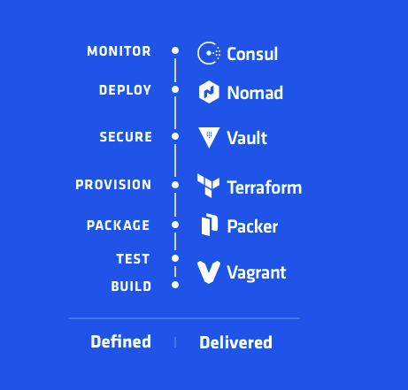
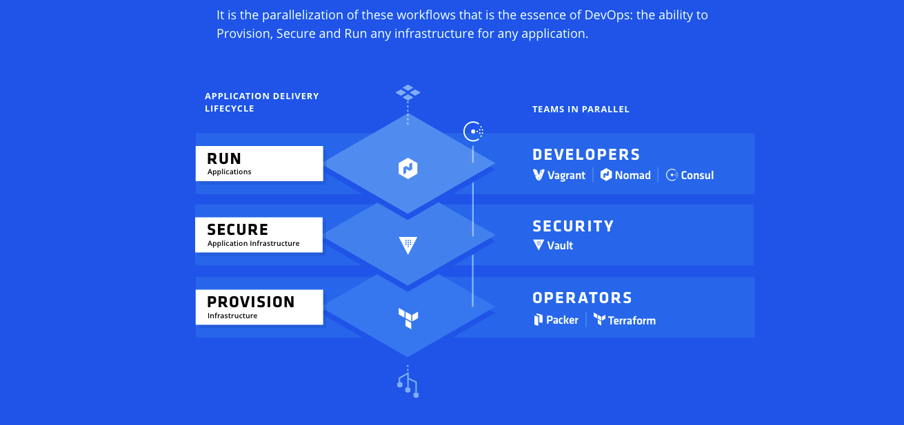

# devops 

## [Introduction](http://www.martinfowler.com/articles/continuousIntegration.html)

* Continuous Integration


* Continuous Delivery


* Continuous Deployment


## DevOps Tools From HashiCorp

* Defined



* Scenarios




## Git

```
brew install git
```

learn git

> [Git Pro](https://git-scm.com/book/en/v2)

> [Git CheatSheet](./git.md)

> [Git Completion](https://github.com/bobthecow/git-flow-completion/wiki/Install-Bash-git-completion)

> If your os is Mac OSX with iTerm2:

* brew install bash-completion

* brew info bash-completion(add something to your ~/.bash_profile)

* iTerm2->Preferences->Profiles(right side panel)->General->Command(option): check Command adding '/usr/local/bin/bash -l'


### Gerrit

> [Code Review](https://www.gerritcodereview.com/index.md)

#### GitLab

* [Install on MacOSX 10.12.1](./gitlab.md)

> https://gitlab.com/gitlab-org/gitlab-ce/blob/master/doc/install/installation.md

> https://github.com/WebEntity/Installation-guide-for-GitLab-on-OS-X

* [Install Docker Gitlab](https://gitlab.com/gitlab-org/gitlab-ce/tree/master/docker)

* [Install Vagrant Gitlab](https://github.com/tuminoid/gitlab-installer)


#### GitHub

##### hub(Option)

```
brew install hub
```
Example:create a repo using command line

> create repo: http://github.com/hongshunyang/devops

```
mkdir devops
cd devops
hub create
```

Or

```
mkdir devops
cd devops

echo "# test" >> README.md
git init
git add README.md
git commit -m "first commit"
git remote add origin https://github.com/hongshunyang/devops.git
git push -u origin master
```


## Jenkins

```
rm -R ~/.jenkins (Reinstall)
brew install jenkins
brew services start/stop/restart jenkins
```
Configure 

> http://localhost:8080/

> GitHub Plugin

## Travis CI

> https://travis-ci.org/


## Docker

> Docker is the world’s leading software containerization platform

> [Get Started](https://www.docker.com/products/docker)

> [Learn Docker](./docker.md)


## CoreOS

## Vagrant/Virtualbox,VMware,AWS

> Create and configure lightweight, reproducible, and portable development environments.

> [Get Started](https://www.vagrantup.com/docs/getting-started/)


## Packer

> Packer is an open source tool for creating identical machine images for multiple platforms from a single source configuration.

> Packer is a tool for creating machine and container images for multiple platforms from a single source configuration.

> [Get Started](https://www.packer.io/)

## Terraform

> Terraform is a tool for building, changing, and versioning infrastructure safely and efficiently. 

> Terraform can manage existing and popular service providers as well as custom in-house solutions.

> WRITE, PLAN, AND CREATE INFRASTRUCTURE AS CODE

> Terraform is not a configuration management tool, 

> And it allows existing tooling to focus on their strengths: bootstrapping and initializing

> [Get Started](https://www.terraform.io/intro/index.html)

## Vault

> Vault is a tool for securely accessing secrets. 

> A secret is anything that you want to tightly control access to, such as API keys, passwords, certificates, and more. 

> Vault provides a unified interface to any secret, while providing tight access control and recording a detailed audit log.

> [Get Started](https://www.vaultproject.io/intro/)

## Nomad

> Nomad is a tool for managing a cluster of machines and running applications on them. 

> Nomad abstracts away machines and the location of applications, 
> and instead enables users to declare what they want to run and Nomad handles where they should run and how to run them.

> [Get Started](https://www.nomadproject.io/intro/index.html)

> [Nomad scheduled 1 million containers on 5,000 hosts in under 5 minutes](https://www.hashicorp.com/c1m.html)

## Consul

> Service Discovery
> Failure Detection
> Multi Datacenter
> Key/Value Storage

> [Get Started](https://www.consul.io/intro/index.html)

## Serf


## Saltstack

> [SaltStack Fundamentals](https://docs.saltstack.com/en/getstarted/fundamentals/index.html)

> [SaltStack Configuration Management](https://docs.saltstack.com/en/getstarted/config/index.html)

> [SaltStack Documention](https://docs.saltstack.com/en/latest/contents.html)

> [JINJA2](http://jinja.pocoo.org/)

## Kubernetes

> [Get Started](http://kubernetes.io/docs/getting-started-guides/)

> [Kick The Tires](http://kubernetes.io/docs/getting-started-guides/#local-machine-solutions)
