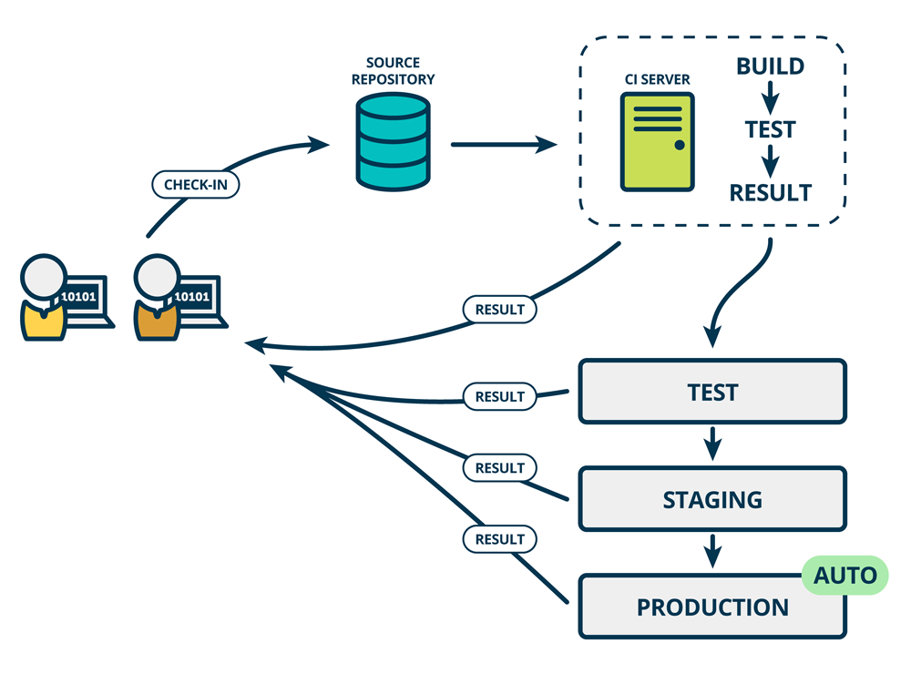

# devops 

## [Introduction](http://www.martinfowler.com/articles/continuousIntegration.html)

* Continuous Integration


* Continuous Delivery


* Continuous Deployment




# Notes

> If your computer os is MacOSX or Windows working on production,

> The best practice is that 

> Install Vagrant first on your macosx or windows, 

> Then build a linux os you like,

> Begin coding in this vagrant+linux development environment.


## Git

```
brew install git
```

learn git

> [Git Pro](https://git-scm.com/book/en/v2)

> [Git CheatSheet](./git.md)

> [Git Completion](https://github.com/bobthecow/git-flow-completion/wiki/Install-Bash-git-completion)

> If your os is Mac OSX with iTerm2:

* brew install bash-completion

* brew info bash-completion(add something to your ~/.bash_profile)

* iTerm2->Preferences->Profiles(right side panel)->General->Command(option): check Command adding '/usr/local/bin/bash -l'


### Gerrit

> [Code Review](https://www.gerritcodereview.com/index.md)

#### GitLab

* [Install on MacOSX 10.12.1](./gitlab.md)

> https://gitlab.com/gitlab-org/gitlab-ce/blob/master/doc/install/installation.md

> https://github.com/WebEntity/Installation-guide-for-GitLab-on-OS-X

* [Install Docker Gitlab](https://gitlab.com/gitlab-org/gitlab-ce/tree/master/docker)

* [Install Vagrant Gitlab](https://github.com/tuminoid/gitlab-installer)


#### GitHub

##### hub(Option)

```
brew install hub
```
Example:create a repo using command line

> create repo: http://github.com/hongshunyang/devops

```
mkdir devops
cd devops
hub create
```

Or

```
mkdir devops
cd devops

echo "# test" >> README.md
git init
git add README.md
git commit -m "first commit"
git remote add origin https://github.com/hongshunyang/devops.git
git push -u origin master
```


## Jenkins

```
rm -R ~/.jenkins (Reinstall)
brew install jenkins
brew services start/stop/restart jenkins
```
Configure 

> http://localhost:8080/

> GitHub Plugin

## Travis CI

> https://travis-ci.org/


## Docker

> Docker is the world’s leading software containerization platform

> [Get Started](https://www.docker.com/products/docker)

> [Learn Docker](./docker.md)


## CoreOS

## Vagrant/Virtualbox,VMware,AWS

> Create and configure lightweight, reproducible, and portable development environments.

> [Get Started](https://www.vagrantup.com/docs/getting-started/)


## Saltstack

> [SaltStack Fundamentals](https://docs.saltstack.com/en/getstarted/fundamentals/index.html)

> [SaltStack Configuration Management](https://docs.saltstack.com/en/getstarted/config/index.html)

> [SaltStack Documention](https://docs.saltstack.com/en/latest/contents.html)

> [JINJA2](http://jinja.pocoo.org/)

## Ansible


